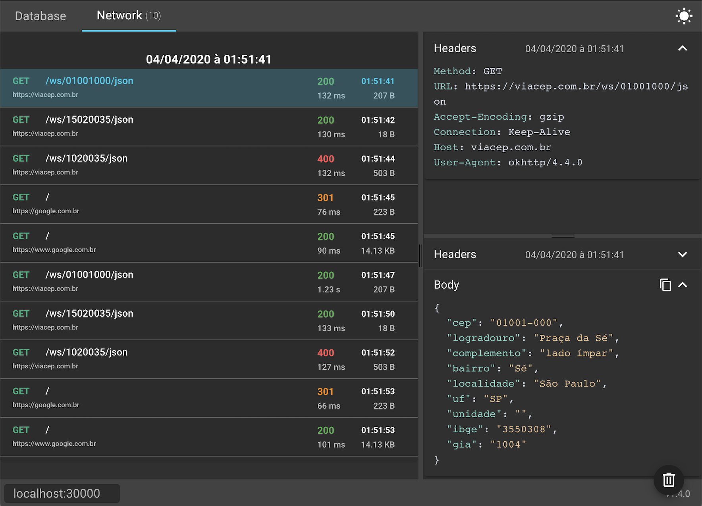

# Inspector Electron

Electron implementation of Inspector by @pakerwreah

Tool to inspect SQLite databases and intercept network requests from mobile applications.

https://github.com/pakerwreah/Inspector

